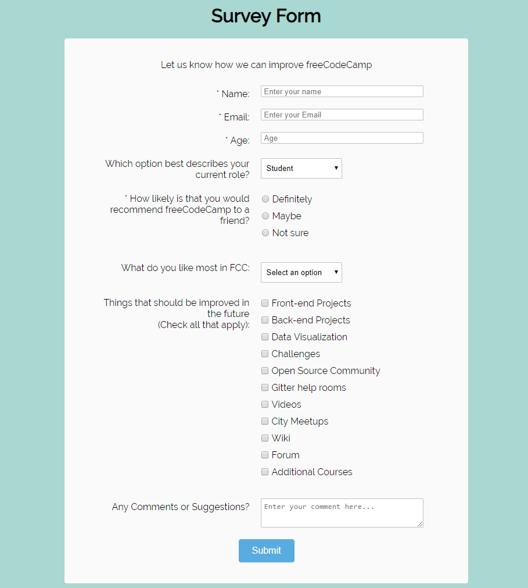

# P1 - My Resume
The first project in `Minders - Web Design` Workshops, it's all about building a simple HTML-only Resume

## Requirements
- Convert the `Result` picture below, into `HTML` page
- ALL content must be `wrapped` within HTML Tags. Make sure to use the appropriate HTML Tags for each part of it!
- Your page must have a `<title>`, with the following scheme: `Your Name | Job Title`
- Write REAL content about yourself, it's your Resume/CV. **Placeholder/Dummy Content won't be accepted**
- Your code must be well-formatted `tree-like` structure
```
<div>
    <p>
        <a href="#"></a>
    </p>
</div>
```
and so on.

## Tips & Tricks
- Wrap each part in a separated `<div>` with a unique `class` attribute
- Remember when to use `<h1>`, `<h2>`, `<p>`, ... etc.
- DON'T cheat/copy others' code. If you don't understand something, ask... But never cheat. **Remember; Our goal is to learn, not to pass the task(s)!**
- Be ready, as you might be asked to explain certain part of the task. **Example: Why did you use X instead of Y?**

## Deliverables Instructions
- Open the [Workshop's Drive](https://drive.google.com/drive/u/0/folders/1NSbd29QsturGGTne4UyBh1VOT3rkduOm)
- Create a folder with your name (i.e. `Yahya Elharony`)
- Inside it, upload the project folder - `P1-Resume` and follow it with `--your-name`. Example: `"P1-Resume--Yahya-Elharony"`
> Naming your Project's Folder with your name will make it easier for the `Project Reviewers` to download/review your code

## Result
